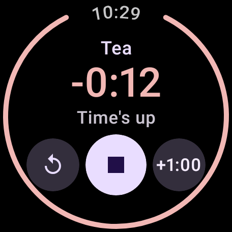
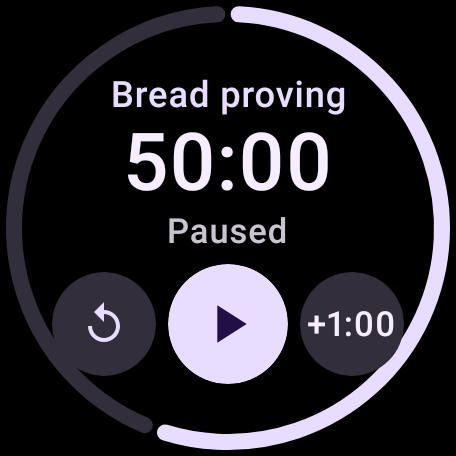

# WearMultiTimer

Several countdown timers at once on a Wear OS watch, each with its own name — in the look of
Google's Clock app. Standalone: no phone app needed.

> **Status:** v0.2.1 — any number of timers: make, run, pause, +1 min, reset, delete, kept when
> the app closes. There's no alarm yet: a finished timer shows "Time's up" in the app but doesn't
> buzz. Alarms arrive in v0.3.

| Timers | One timer | New timer |
|---|---|---|
|  |  |  |
|  |  |  |

## Using it

- **New timer** (bottom of the list): tap a common duration to start it straight away, or
  **Custom** for hours, minutes and seconds.
- **Tap a timer** to open it: pause/resume in the middle, reset on the left, **+1:00** on the right.
  Once reset, the left button deletes it. When the time's up the middle button stops it.
- **Swipe a timer left** in the list to delete it.
- Swipe right to go back, as everywhere on Wear OS.

## Planned for version 1

- A list of all your timers, with time left and whether each is running, paused or ringing
- Any number of timers at once: pause, resume, +1 min, reset, delete
- Optional names ("Pasta", "Laundry") by keyboard or voice
- Presets: a named duration you start with one tap
- A full-screen alert with the timer's name when it finishes
- The running timer shown at the foot of the watch face
- Timers that survive the app closing, the watch restarting and battery saving

## Install

Download `WearMultiTimer-vX.Y.apk` from the [latest release](../../releases/latest), then either:

**ADB** (on a computer, watch on the same Wi-Fi):

1. On the watch: Settings → System → About → tap *Build number* 7 times to enable Developer options.
2. Settings → Developer options → turn on *ADB debugging* and *Wireless debugging*.
3. In *Wireless debugging* tap *Pair new device* and note the pairing code and address.
4. On the computer:
   ```
   adb pair <pairing ip:port> <code>
   adb connect <ip:port shown on the Wireless debugging screen>
   adb install WearMultiTimer-vX.Y.apk
   ```

**Wear Installer 2** (from the phone, no computer): follow the app's instructions for wireless
debugging, then pick the downloaded APK.

Updates install over the top the same way; your timers are kept.

## Building

```
./gradlew assembleDebug        # app/build/outputs/apk/debug/app-debug.apk
./gradlew testDebugUnitTest
```

Needs JDK 17 and the Android SDK (platform 37).

Screenshots of the screens, rendered on the computer (round, large font):

```
./gradlew testDebugUnitTest -Pscreenshots --tests '*ScreensTest*'   # app/build/screenshots/
```

## Releasing

1. Bump `appVersionCode` (by 1) and `appVersionName` in `gradle.properties`.
2. Commit, then tag with the same name: `git tag v0.2 && git push origin main v0.2`.
3. The *Release* workflow builds the signed APK and publishes the GitHub release.

### Signing key (one-off setup)

Every release must be signed with the same key, or the watch refuses to update over the
installed app. Create the key once and keep a backup of it somewhere safe:

```
keytool -genkeypair -v -keystore wearmultitimer.jks -alias wearmultitimer \
  -keyalg RSA -keysize 4096 -validity 10000
base64 -w 0 wearmultitimer.jks > wearmultitimer.jks.b64    # macOS: base64 -i wearmultitimer.jks
```

Then on GitHub: *Settings → Secrets and variables → Actions → New repository secret*:

| Secret | Value |
|---|---|
| `WMT_KEYSTORE_BASE64` | the contents of `wearmultitimer.jks.b64` |
| `WMT_KEYSTORE_PASSWORD` | the keystore password you chose |
| `WMT_KEY_ALIAS` | `wearmultitimer` |
| `WMT_KEY_PASSWORD` | the key password (the same as the keystore password unless you set another) |

For signed builds on your own computer, create `keystore.properties` (it's gitignored):

```
storeFile=wearmultitimer.jks
storePassword=…
keyAlias=wearmultitimer
keyPassword=…
```

## Credits

The look follows Google's Clock app for Wear OS (which isn't open source); the app is written from
scratch with Compose for Wear OS Material 3.
