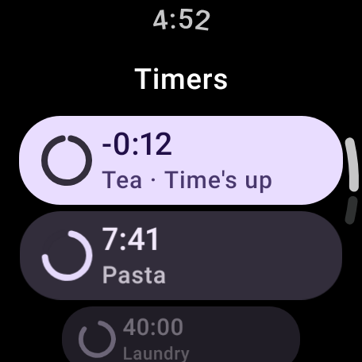
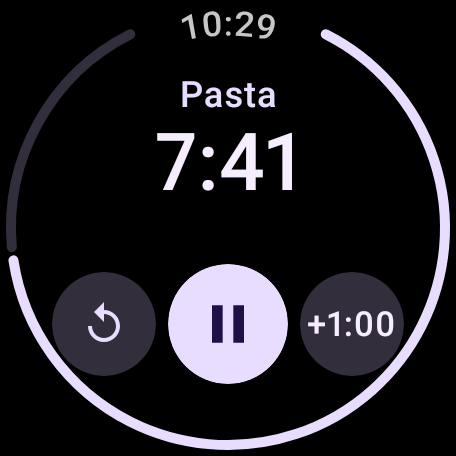
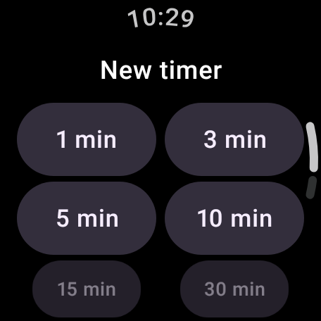
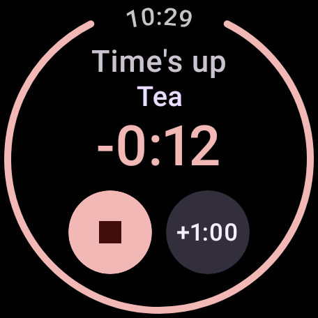
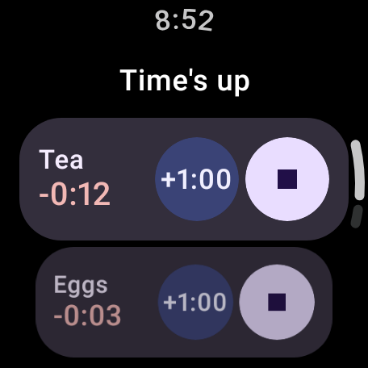
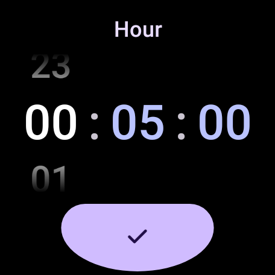
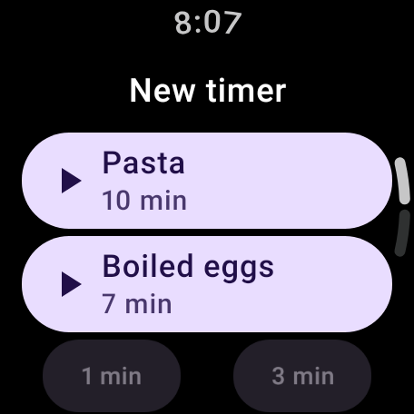
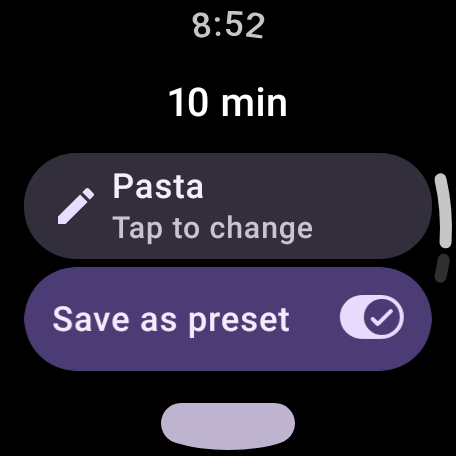
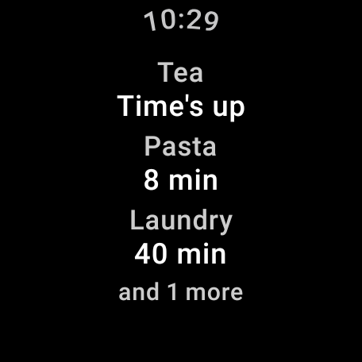

# WearMultiTimer

Several countdown timers at once on a Wear OS watch, each with its own name — in the look of
Google's Clock app. Standalone: no phone app needed.

> **Status:** v0.6.1 — any number of named timers and presets; finished timers ring, even with the
> app closed or the watch asleep; the running timer shows at the foot of the watch face; the app
> stays on screen, dimmed, when the watch dims; and it updates itself. Next: v1.0.

| Timers | One timer | New timer |
|---|---|---|
|  |  |  |
|  |  |  |
|  |  |  |

## Using it

- **New timer** (bottom of the list - scroll down if it's tucked away): your **presets** first,
  one tap starts one; then common durations, and **Custom** for hours, minutes and seconds.
- After picking a duration: **Add a name** (keyboard or voice) if you like, and **Save as preset**
  to keep the name and duration for next time; then **Start**. Unnamed timers are called by their
  duration.
- **Tap a timer's name** on its own screen to rename it.
- **Swipe a preset left** on the New timer screen to delete it.
- While a timer runs, its icon sits at the **foot of the watch face**; tap it to open the app.
- When the watch **dims** with the app open, it stays on screen dimmed, showing your timers to the
  minute; raise your wrist or tap and you're back where you were.
- Turn the **crown** to scroll any list.
- **Tap a timer** to open it: pause/resume in the middle, reset on the left, **+1:00** on the right.
  Once reset, the left button deletes it. When the time's up the middle button stops it.
- **Swipe a timer left** in the list to delete it.
- Swipe right to go back, as everywhere on Wear OS.

### When a timer finishes

- The watch buzzes and chimes, with a full-screen **Time's up** showing the timer and how long ago
  it finished. The chime plays at the watch's **alarm volume**, on sound or vibrate, as Google
  Clock's does; only silent mode keeps it quiet.
- **Stop** resets the timer (it stays in the list, ready to run again); **+1:00** gives it another minute.
- Several at once are listed together, with **Stop all** at the bottom.
- The notification has **Stop** and **+1 min** too, for every finished timer.
- It rings for up to ten minutes, as Google Clock does. Then it gives up and a silent **Missed ·
  ended at 14:05** notification stays until you stop the timer.
- Putting the watch **on its charger** stops the ringing (the timer counts as missed).
- **During a call** it only buzzes - no chime - and chimes again if the call ends while it rings.
- Timers ring even on a watch that has **just restarted and not been unlocked** yet.
- First time you open the app it asks to send notifications: say yes, or nothing can alert you.
  If notifications or full-screen alerts are off, a red notice at the top of the list takes you to
  the setting.

## Planned for version 1

- A list of all your timers, with time left and whether each is running, paused or ringing
- Any number of timers at once: pause, resume, +1 min, reset, delete
- Optional names ("Pasta", "Laundry") by keyboard or voice
- Presets: a named duration you start with one tap
- A full-screen alert with the timer's name when it finishes
- The running timer shown at the foot of the watch face
- Timers that survive the app closing, the watch restarting and battery saving

## Install

Download `WearMultiTimer-vX.Y.apk` from the [latest release](../../releases/latest), then either:

**ADB** (on a computer, watch on the same Wi-Fi):

1. On the watch: Settings → System → About → tap *Build number* 7 times to enable Developer options.
2. Settings → Developer options → turn on *ADB debugging* and *Wireless debugging*.
3. In *Wireless debugging* tap *Pair new device* and note the pairing code and address.
4. On the computer:
   ```
   adb pair <pairing ip:port> <code>
   adb connect <ip:port shown on the Wireless debugging screen>
   adb install WearMultiTimer-vX.Y.apk
   ```

**Wear Installer 2** (from the phone, no computer): follow the app's instructions for wireless
debugging, then pick the downloaded APK.

### Updates

From v0.3.3 the app updates itself. When it's opened it looks for a newer release (at most every
half hour); if there is one, **Update to x.y** appears at the top of the list. Tap it, and confirm
on the watch's install screen. The foot of the list shows the version installed - tap it to look
again straight away. Your timers are kept.

The first time, the watch asks to let the app install updates. If it has no screen for that, allow
it once with ADB:

```
adb shell appops set io.github.iannicholls89.wearmultitimer REQUEST_INSTALL_PACKAGES allow
```

Versions before v0.3.3 can't update themselves: install v0.3.3 by ADB once.

### Let alerts fill the screen (once)

Google Clock is part of the watch, so it can put "Time's up" over whatever is on screen. An
installed app may only do that with permission to *display over other apps*, which a watch has no
switch for — so grant it with ADB, once, while you're connected to install:

```
adb shell appops set io.github.iannicholls89.wearmultitimer SYSTEM_ALERT_WINDOW allow
```

Without it a finished timer still buzzes and chimes, but shows as a notification you tap to open.
It's kept across updates; the red notice in the app goes once it's granted.

## Building

```
./gradlew assembleDebug        # app/build/outputs/apk/debug/app-debug.apk
./gradlew testDebugUnitTest
```

Needs JDK 17 and the Android SDK (platform 37).

The chime is made by `tools/make_chimes.py` (needs numpy), which writes three to `docs/chimes/`:
[A, glass](docs/chimes/a_glass.wav) (the one in the app), [B, wind chimes](docs/chimes/b_wind.wav),
[C, bell](docs/chimes/c_bell.wav), and three layered takes on C: [C2, layered bell](docs/chimes/c2_layered_bell.wav),
[C3, bell chord](docs/chimes/c3_bell_chord.wav) and [C4, soft mallet](docs/chimes/c4_soft_mallet.wav).
To change it, copy one over `app/src/main/res/raw/timer_chime.wav`.

Screenshots of the screens, rendered on the computer (round, large font):

```
./gradlew testDebugUnitTest -Pscreenshots --tests '*ScreensTest*'   # app/build/screenshots/
./gradlew testDebugUnitTest -Pscreenshots -PfontScale=1.3 --tests '*ScreensTest*'   # largest text
```

## Releasing

1. Bump `appVersionCode` (by 1) and `appVersionName` in `gradle.properties`.
2. Commit, then tag with the same name: `git tag v0.2 && git push origin main v0.2`.
3. The *Release* workflow builds the signed APK and publishes the GitHub release, with a
   `version.json` beside it - which is how installed apps find the update.

### Signing key (one-off setup)

Every release must be signed with the same key, or the watch refuses to update over the
installed app. Create the key once and keep a backup of it somewhere safe:

```
keytool -genkeypair -v -keystore wearmultitimer.jks -alias wearmultitimer \
  -keyalg RSA -keysize 4096 -validity 10000
base64 -w 0 wearmultitimer.jks > wearmultitimer.jks.b64    # macOS: base64 -i wearmultitimer.jks
```

Then on GitHub: *Settings → Secrets and variables → Actions → New repository secret*:

| Secret | Value |
|---|---|
| `WMT_KEYSTORE_BASE64` | the contents of `wearmultitimer.jks.b64` |
| `WMT_KEYSTORE_PASSWORD` | the keystore password you chose |
| `WMT_KEY_ALIAS` | `wearmultitimer` |
| `WMT_KEY_PASSWORD` | the key password (the same as the keystore password unless you set another) |

For signed builds on your own computer, create `keystore.properties` (it's gitignored):

```
storeFile=wearmultitimer.jks
storePassword=…
keyAlias=wearmultitimer
keyPassword=…
```

## Credits

The look follows Google's Clock app for Wear OS (which isn't open source); the app is written from
scratch with Compose for Wear OS Material 3.
